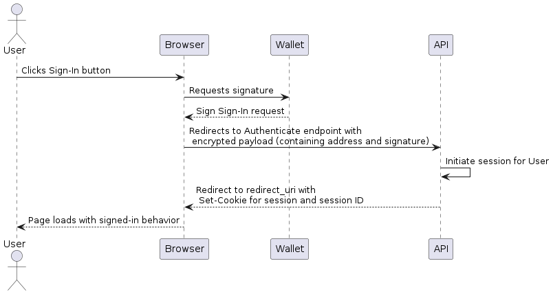

# decentralized-identity-web

This project explores a very simple domain system authentication with an Ethereum-compatible crypto wallet and compatible browser (web or mobile).

## Available Wallets

- [TrustWallet](https://trustwallet.com/)
- [MetaMask](https://metamask.io/)
- [Klever Wallet](https://wallet.klever.finance/)

and surely many others!

## Authentication Flow

Putting into words, the flow goes down exactly like this:

1. The user clicks the Sign-In button
2. Browser requests a signature to Wallet (browser extension or mobile)
3. Wallet returns signed request
4. Browser redirects to the authenticate endpoint with encrypted payload (containing address and signature)
5. API initiates a session for the user
6. API redirects to redirect URI (pre-registered at Auth API service for security) with Set-Cookie for the encrypted session and session ID
7. Browser loads page with signed-in behavior (by detecting the presence of the session ID cookie)

## Components

### Frontend

A dead simple web application made with React, with the following functionalities:

- [x] Connect to Wallet
- [x] Authenticate to domain systems (create a cookie-based session for the domain)
- [ ] Manage to-do tasks for the authenticated wallet

### Auth Service

A Golang API to handle authentication and query for authenticated wallet info.

### To Do Service

A Golang API to handle To Do's management (.a.k.a CRUD) operations.

### Database

A NoSQL database service to store To Do's managed documents.